### Запуск

клонирование
```bash
git clone
uv sync
```

запуск тестов
```bash
uv run pytest
```

запуск compose
```bash
docker compose up -d --build
```

запуск kubernetes
```bash
kind create cluster --name mlpro
```


### Скрины терминала

#### Запуск тестов
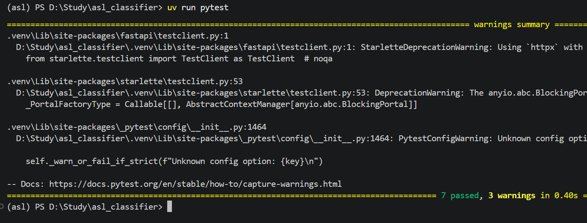

---

#### SELECT из лого
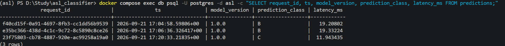

---

#### get pods
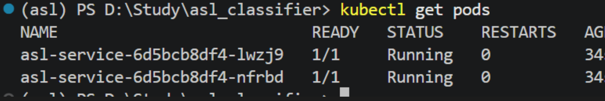

---

#### ответ predict port-forward
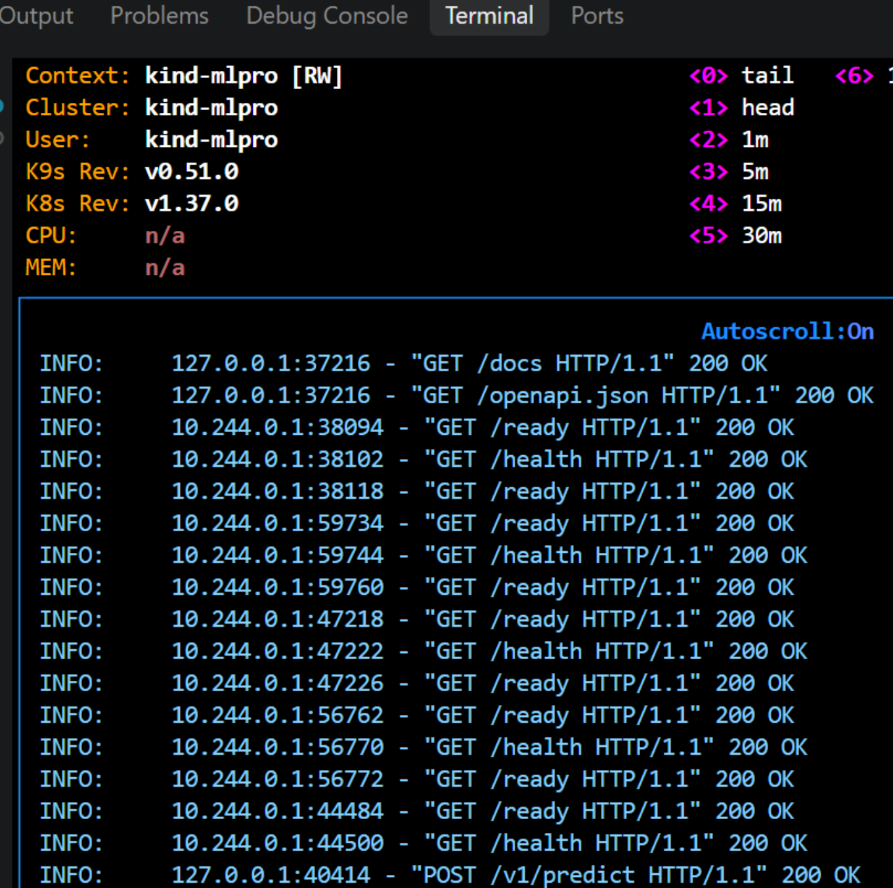

---

### Скрин k9s
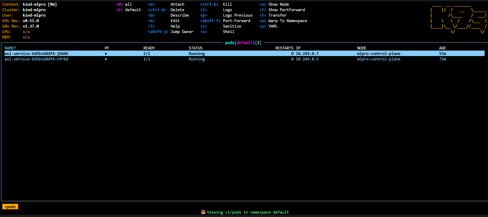

---

### Журнал проблем


> При переходе на python 3.11 проект ломался на uv sync - ошибка была связана с stringzilla

Ответ по ошибке в терминале предложил установить windows c++ build tools. Решил остаться на 3.12, если нужно будет перейти на 3.11, вернусь к проблеме.

---

>(asl) PS D:\Study\asl_classifier> uv run uvicorn asl.service.app:app --port 8000
>Failed to canonicalize script path

Пока разбирался с версиями python, скорее всего поломал что-то в uvicorn. Решилось пересозданием .venv через uv sync

---

Проблема получения аттрибута

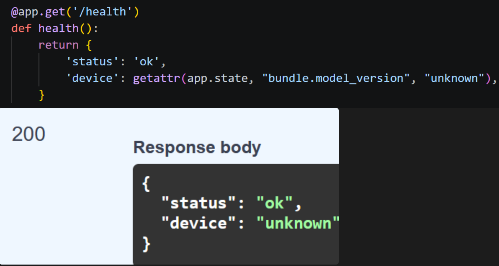

Из-за матрешки с InferenceBundle getattr не может дойти до нужного атрибута таким способом. Поэтому реализовал health, ready так:
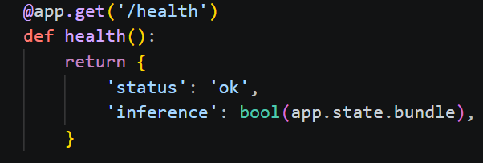

---

> pydantic_core._pydantic_core.ValidationError: 2 validation errors for Prediction
> all_probabilities.0
>  Input should be a valid number [type=float_type, input_value=tensor([1.0000e+00, 2.4000e-13, 2.0771e-11]), input_type=Tensor]
>  For further information visit https://errors.pydantic.dev/2.13/v/float_type
>  request_id
>  Input should be a valid integer, unable to parse string as an integer [type=int_parsing, input_value='39fc411c-462c-47a8-b533-3144b7ad224f', input_type=str]
>  For further information visit https://errors.pydantic.dev/2.13/v/int_parsing

request_id вписал тип int, а не str.
конвертировал all_probabilities из тензора в список: all_probabilities = all_probabilities[0].tolist() (реализация через torch, после перешел на onnx)

---

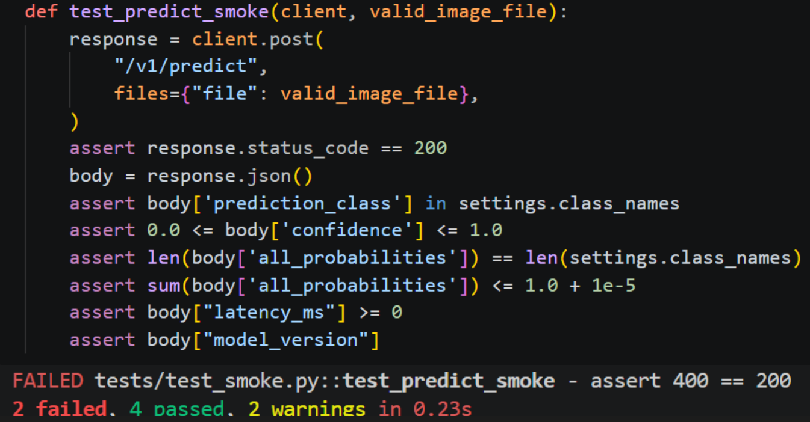

загрузка изображения в pytest отличается от jsonb на семинаре. По итогу просто неправильно вписал переменную:
![[Pasted image 20260920201015.png]]

---

> Докер долго собирается

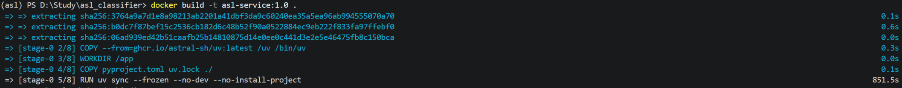

Для скорости перевел модель с pt на onnx. Вместе с этим, predict ускорился с 40мс до 22мс на первый вызов.

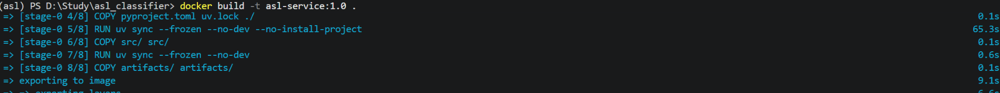

---

> При запуске docker compose сервис не запускается

Оказалось, api падал:
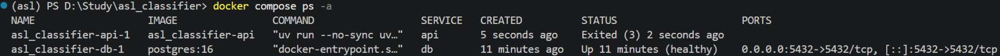

Забыл добавить скобки

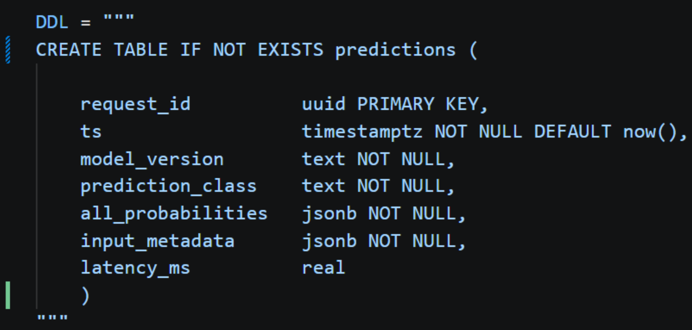